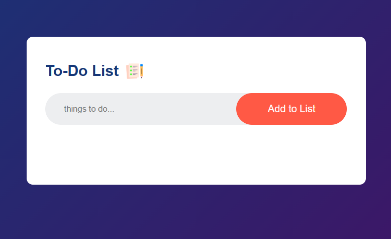
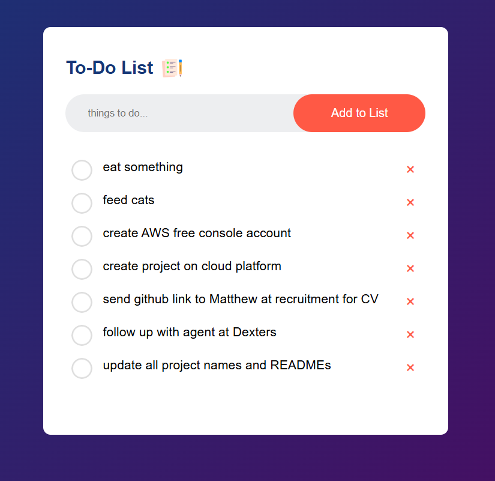
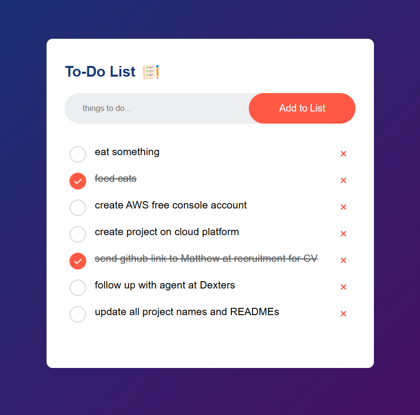

# ToDo List App
A clean and simple To‑Do List application built with HTML, CSS, and JavaScript.
This project allows users to add, delete, and manage daily tasks in a minimal, responsive interface.
It’s designed as a foundational front‑end project to demonstrate DOM manipulation, event handling, and UI design.

Live Demo: (Add your GitHub Pages link here)  
Frontend Repo: https://github.com/STEM-Girlie/ToDo-List

## Table of Contents

- [Overview](#overview)
- [Features](#features)
- [Tech Stack](#tech-stack)
- [Architecture](#architecture)
- [Database Design](#database-design)
- [API Endpoints](#api-endpoints)
- [Installation](#installation)
- [Environment Variables](#environment-variables)
- [Usage](#usage)
- [Screenshots](#screenshots)
- [Deployment](#deployment)
- [Future Improvements](#future-improvements)
- [Credits](#credits)
- [License](#license)

## Overview
### Motivation
This project was created to strengthen core front‑end development skills and practice building interactive UI components without frameworks.

### Objective
Provide a simple, intuitive tool for users to track tasks while demonstrating clean code structure and DOM manipulation.

### Learning Outcomes
- Manipulating the DOM with vanilla JavaScript
- Handling user input and events
- Creating responsive layouts with CSS
- Structuring small front‑end projects
- Deploying static sites with GitHub Pages

  ## Features
- Add new tasks
- Delete tasks
- Mark tasks as completed
- Clean, responsive UI
- Local, client‑side functionality (no backend required)

## Tech Stack
### Frontend
- HTML5
- CSS3
- JavaScript (Vanilla)

### Tools
- Git & GitHub
- VS Code
- GitHub Pages (Deployment)

## Architecture
Client (Browser)
↓
JavaScript Logic (DOM Manipulation)
↓
Local Rendering of Tasks

### Folder Structure:
  ToDo-List/
 ├── index.html
 ├── style.css
 ├── script.js
 └── images/

## Database Design
This project does not use a database.
All tasks exist only in the browser session.

## API Endpoints
This project does not include a backend or API.

## Installation
### Clone the Repository
git clone https://github.com/STEM-Girlie/ToDo-List.git
cd ToDo-List

No dependencies are required — this is purely a front‑end project.

## Usage
1. Open index.html in your browser
2. Type a task into the input field
3. Click Add
4. Mark tasks as complete or delete them

## Screenshots
assets/
 ├── homepage.png
 └── tasklist.png
 └── completedtasks.png

 
 

## Deployment
You can deploy this project easily using GitHub Pages:

1. Go to Settings → Pages
2. Select branch: main
3. Folder: /root
4. Save

## Future Improvements
- Add LocalStorage to persist tasks
- Add categories or priority levels
- Add animations and transitions
- Add dark mode
- Add drag‑and‑drop task reordering

## Credits
Developer: Nasreen Baker  
GitHub: https://github.com/STEM-Girlie

## License
This project is licensed under the MIT License.
